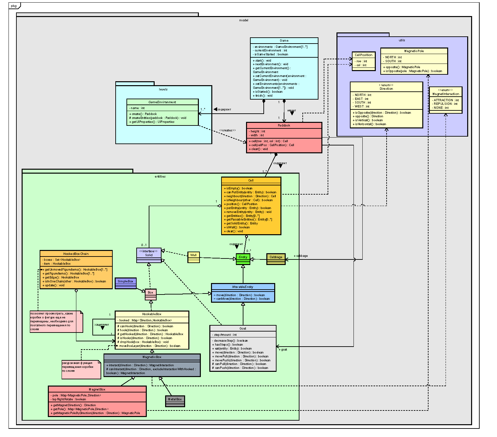
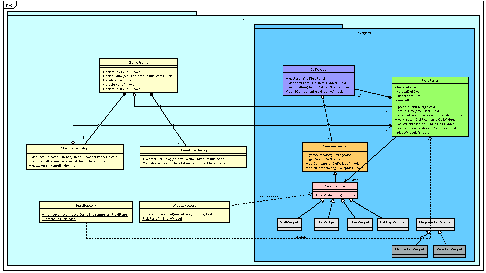

# GoatCabbage

Игра "Коза и капуста".

Правила игры:

- имеется загон NxM клеток, в котором находится коза, капуста, ящики и стены (располагаются внутри клеток);
- ящики (могут быть обычными, магнитными, металлическими) и стены, возможно, образуют непроходимый лабиринт;
- цель козы — добраться до капусты, двигая ящики;
- коза может двигать только один ящик от себя или на себя;
- количество шагов козы ограничено.

#### Диаграммы классов

